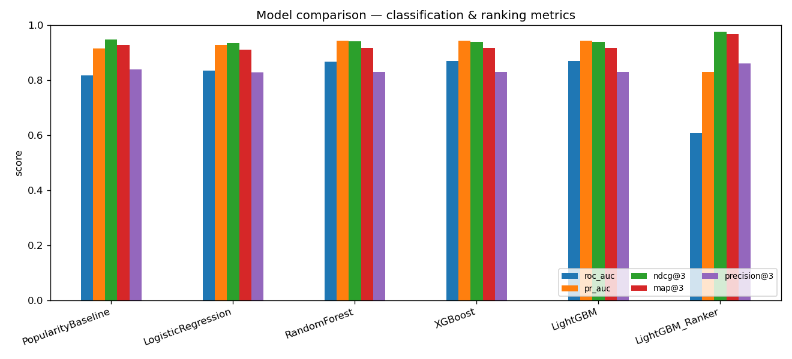

# 🎯 Smart Offer Targeting System | Recommendation / Financial Analytics

An end-to-end machine-learning system that predicts which **card / app offers** a
customer is most likely to **engage with**, and **ranks the Top-K offers per
customer** for personalised campaigns.

Built on the **real Starbucks Rewards offer dataset** — 17,000 customers, 10
offers, and 306,534 events (offers received / viewed / completed + transactions).

> **Why this project is relevant** — it mirrors exactly what offer-targeting and
> card-rewards teams do at companies like American Express, Mastercard, Accertify
> and consulting analytics teams: take customer profile + transaction history +
> offer attributes, predict response, and decide *which few offers to show whom*.

---

## 1. Business problem

A card / payments company has many customers and many offers (cashback, discount,
BOGO-style rewards, informational nudges). Showing **every** offer to **everyone**
is wasteful and annoying. The company wants to show each customer **only the
handful of offers they are most likely to act on**, to lift conversion, engagement
and transaction growth while cutting contact cost.

This is a **recommendation / learning-to-rank** problem: for each customer, score
all offers and surface the **Top-K**.

---

## 2. Dataset

**Real data** — the Starbucks Rewards "offer" dataset (Udacity capstone), three
JSON files:

| File | Grain | Key fields |
|------|-------|-----------|
| `portfolio.json` | 10 offers | `offer_type` (bogo / discount / informational), `reward`, `difficulty` (min spend), `duration`, `channels` |
| `profile.json` | 17,000 customers | `age`, `gender`, `income`, `became_member_on` |
| `transcript.json` | 306,534 events | `offer received`, `offer viewed`, `offer completed`, `transaction` (with `amount`), `time` (hours) |

**Honest notes (interview-defensible):**
- This real dataset has **no merchant-category column**. So we use the **offer
  type** (bogo / discount / informational) as the offer category, and engineer
  **category affinity** = each customer's historical response rate per offer type.
- ~2,175 customers are **placeholders** (age = 118, missing gender/income). We
  **flag** them (`missing_demographics`) and impute, rather than silently dropping.
- The data is real customer-behaviour data; the only **synthetic** element in the
  whole project is the *expected campaign value* formula (clearly an assumption,
  used only to prioritise — see §7).

### Target definition

Each row of the modelling table = one **"offer received"** event. The label:

```
clicked  = 1 if the customer VIEWED that offer within its validity window
accepted = 1 if the customer COMPLETED that offer within its window  (secondary)
```

We model **`clicked`** (engagement) as the primary target because it applies to
**all** offers — informational offers can be viewed but never "completed".
Overall click rate = **74.6%**.

---

## 3. Methodology / pipeline

```
download_data → data_prep → eda → train → recommend → dashboard
```

1. **Data prep** (`src/data_prep.py`) — parse the JSONs, clean profiles, and build
   one **leakage-free** modelling table at the (customer × offer-instance) grain.
2. **EDA** (`src/eda.py`) — distributions and click-rate breakdowns.
3. **Train** (`src/train.py`) — 5 models + a popularity baseline, evaluated with
   classification **and** ranking metrics.
4. **Recommend** (`src/recommend.py`) — score all 10 offers per customer, rank
   Top-K, attach expected value + reason.
5. **Dashboard** (`app/streamlit_app.py`).

### ⭐ No data leakage (the most important design choice)

All "history" features (past spend, recency, past offer-response rates, category
affinity) are computed using **only events that happened strictly before** the
offer was received. We walk each customer's events in time order and **snapshot**
their running state at each "offer received". Train / validation / test are split
**by customer**, so a customer's rows never straddle two splits.

---

## 4. Feature engineering

| Group | Features |
|-------|----------|
| **Recency / Frequency / Monetary** | `recency` (hours since last txn), `txn_count`, `total_spend`, `avg_spend` |
| **Offer-response history** | `prior_offers_received`, `prior_view_rate`, `prior_completion_rate` |
| **Category affinity** | `type_view_rate` — customer's past view rate for *this offer type* |
| **Offer attributes** | `reward`, `difficulty`, `duration`, `n_channels`, channel flags, `reward_per_difficulty` (attractiveness) |
| **Customer profile / segments** | `age`, `income`, `membership_days`, `gender`, `income_segment`, `age_group`, `missing_demographics` |
| **Customer × offer interactions** | `income_to_difficulty`, `spend_to_difficulty` |

---

## 5. Models

| # | Model | Role |
|---|-------|------|
| 0 | **Popularity baseline** | Rank offers by their global view-rate. "Did ML beat just showing popular offers?" |
| 1 | **Logistic Regression** | Interpretable linear baseline |
| 2 | **Random Forest** | Non-linear bagging |
| 3 | **XGBoost** | Gradient boosting |
| 4 | **LightGBM** | Fast gradient boosting |
| 5 | **LightGBM Ranker** | Learning-to-rank (LambdaRank) — optimises ordering directly |

---

## 6. Results (held-out test set, split by customer)

| Model | ROC-AUC | PR-AUC | Precision | Recall | F1 | P@3 | R@3 | MAP@3 | NDCG@3 | NDCG@5 |
|-------|:------:|:------:|:--------:|:-----:|:---:|:---:|:---:|:-----:|:------:|:------:|
| Popularity baseline | 0.817 | 0.916 | 0.788 | 0.953 | 0.862 | 0.839 | 0.806 | 0.929 | 0.949 | 0.972 |
| Logistic Regression | 0.835 | 0.929 | 0.924 | 0.731 | 0.816 | 0.830 | 0.795 | 0.912 | 0.936 | 0.965 |
| Random Forest | 0.868 | 0.944 | 0.924 | 0.773 | 0.841 | 0.831 | 0.797 | 0.918 | 0.941 | 0.968 |
| **XGBoost** | 0.870 | **0.945** | 0.868 | 0.914 | 0.890 | 0.830 | 0.797 | 0.917 | 0.941 | 0.968 |
| LightGBM | **0.871** | 0.944 | 0.870 | 0.913 | **0.891** | 0.830 | 0.797 | 0.917 | 0.941 | 0.968 |
| **LightGBM Ranker** | 0.608* | 0.831* | — | — | — | **0.862** | **0.829** | **0.968** | **0.978** | **0.989** |

\* The Ranker outputs an **uncalibrated ordering score**, not a probability, so its
global ROC/PR-AUC look low — that is expected and not a defect.



### How to read this (the interesting part)

- **Boosting wins on classification** — XGBoost / LightGBM reach **ROC-AUC ≈ 0.87,
  PR-AUC ≈ 0.945**, a clear lift over the linear baseline.
- **The popularity baseline is strong** — because the base click rate is high
  (74.6%) and offer *type* alone is very predictive. Reporting it keeps us honest:
  classification AUC gains are real, but on ranking metrics the classifiers barely
  beat "just show the popular offers".
- **Learning-to-rank is the right tool** — the **LightGBM Ranker is the only model
  that clearly beats the popularity baseline on the metrics that matter for this
  business** (MAP@3 **0.968** vs 0.929, NDCG@3 **0.978** vs 0.949), because it
  optimises *per-customer ordering* instead of global probability.

### Why ranking metrics matter here

The business shows only the **top few** offers per customer, so what matters is
"are the offers a customer will engage with **near the top** of our ranked list?"

- **Precision@K** — of the top-K offers we recommend, what fraction are relevant.
- **Recall@K** — of all offers the customer would engage with, how many are in the top-K.
- **MAP@K** (Mean Average Precision) — rewards putting relevant offers **higher up**.
- **NDCG@K** — like MAP but with a smooth log position-discount; 1.0 = perfect order.

(Plain-language explanations are also in §"Interview prep" of this README and in
`src/metrics.py`.)

---

## 7. Business output

For any customer the system returns the **Top-K** offers with:

| Column | Meaning |
|--------|---------|
| `customer_id` | who |
| `rank` | 1 … K |
| `offer_id` / `offer_type` / `offer_label` | which offer |
| `click_probability` | predicted affinity |
| `expected_value` | `P(click) × margin − contact_cost` — for prioritisation |
| `recommendation_reason` | short human-readable "why" |

> **Expected campaign value is the only assumed number** in the project
> (`ENGAGED_MARGIN` and `CONTACT_COST` in `src/config.py`). It is **not** claimed
> as real revenue — it just lets the business trade off "likely to engage" against
> "cheap to contact" when picking targets.

Example (real output):

```
Customer 00096557...
 rank offer_type  click_probability  expected_value  recommendation_reason
    1   discount             0.972          3.74      reachable on mobile/social; recently active spender
    2   discount             0.971          3.74      reachable on mobile/social; recently active spender
    3       bogo             0.969          3.73      history of engaging with bogo offers; strong reward-to-spend ratio
```

---

## 8. Dashboard

`streamlit run app/streamlit_app.py` — five sections:

1. **Overview** — project & headline numbers
2. **Dataset** — offer catalogue + EDA charts
3. **Model performance** — full metrics table + comparison chart
4. **Recommendations** — pick a customer → live Top-K (rank by probability or expected value)
5. **Business insights**

📸 *Add screenshots to `screenshots/` and embed them here:*

```


```

---

## 9. How to run locally

```bash
# 1. (recommended) create a clean environment
python -m venv .venv && source .venv/bin/activate     # or use conda
pip install -r requirements.txt

# 2. get the real dataset (~40 MB)
python -m src.download_data

# 3. build the leakage-free model table  (~5 s)
python -m src.data_prep

# 4. exploratory figures
python -m src.eda

# 5. train + compare all models  (~10 s)
python -m src.train

# 6. generate sample recommendations
python -m src.recommend

# 7. launch the dashboard
streamlit run app/streamlit_app.py
```

> **macOS / Anaconda note:** XGBoost and LightGBM each bundle their own OpenMP
> runtime, which can segfault when loaded together. The code sets
> `KMP_DUPLICATE_LIB_OK=TRUE` and `OMP_NUM_THREADS=1` automatically, so you don't
> need to do anything — but a clean `venv` is the most reliable setup.

---

## 10. Repository structure

```
smart-offer-targeting/
├── README.md
├── requirements.txt
├── .gitignore
├── data/
│   ├── raw/            # 3 Starbucks JSONs (downloaded, gitignored)
│   └── processed/      # model_table.csv + cleaned tables
├── notebooks/
│   └── 01_exploration.ipynb
├── src/
│   ├── config.py       # paths + constants + business assumptions
│   ├── download_data.py
│   ├── data_prep.py    # leakage-free labelled table
│   ├── eda.py
│   ├── metrics.py      # ranking metrics (P@K, R@K, MAP@K, NDCG@K)
│   ├── train.py        # 5 models + baseline, classification + ranking eval
│   └── recommend.py    # Top-K serving layer
├── app/
│   └── streamlit_app.py
├── models/             # best_model.pkl (generated)
├── reports/            # metrics.json, comparison csv, figures/
└── screenshots/        # dashboard screenshots (add your own)
```

---

## 11. Key business insights

- **Offer type is the biggest lever** — BOGO offers are viewed far more than
  informational ones; the catalogue mix itself drives engagement.
- **Past behaviour predicts future** — customers who engaged before are much more
  likely to engage again, so offer-response history is a top feature.
- **Ranking beats classification for this use-case** — because only a few offers
  are shown, optimising *ordering* (the Ranker) lifts MAP@K / NDCG@K above a strong
  popularity baseline.
- **Targeting saves money** — showing each customer their Top-3 instead of all
  offers focuses spend on likely engagers and cuts wasted contact cost.

---

## 12. Future improvements

- Add **time-decayed** RFM features and seasonality.
- **Calibrate** the ranker's scores (e.g. isotonic) to recover probabilities.
- Two-stage **candidate-generation → re-ranking** for larger offer catalogues.
- **Uplift / causal** modelling (treat vs control) to target *incremental*
  responders, not just likely responders.
- **A/B test** the recommender against the current strategy; track real conversion lift.
- Bring in **merchant category** data where available for richer affinity features.

---

## CV bullets

**Smart Offer Targeting System | Recommendation / Financial Analytics**
- Built an end-to-end offer-targeting pipeline on the **real Starbucks Rewards dataset** (17K customers, 306K events), engineering **leakage-free** RFM, offer-response-history and category-affinity features from raw transaction logs.
- Benchmarked Logistic Regression, Random Forest, XGBoost and LightGBM, reaching **ROC-AUC 0.87 / PR-AUC 0.95** for offer-click prediction, against a popularity baseline.
- Implemented a **LightGBM learning-to-rank** model that beat the baseline on the metrics that matter — **MAP@3 0.97, NDCG@3 0.98** — and evaluated with Precision@K / Recall@K / MAP@K / NDCG@K.
- Delivered a **Top-K offer recommender** (predicted affinity + expected campaign value + reason) served through a **Streamlit** dashboard for campaign personalisation.

---

## Interview preparation

### 10 questions & crisp answers

1. **What problem does this solve?**
   We rank offers per customer so the business shows each person the few offers
   they're most likely to act on — lifting conversion and cutting contact cost.

2. **How did you define the target?**
   `clicked` = the customer *viewed* the offer within its validity window. It
   applies to all offers (informational ones can't be "completed"), and it's the
   cleanest engagement signal.

3. **How did you avoid data leakage?**
   Every history feature is snapshotted using only events *before* the offer was
   received, by walking each customer's timeline in order. Train/val/test are split
   **by customer**, never by row.

4. **Why both classification and ranking metrics?**
   Classification (AUC/PR-AUC) measures "can we tell engagers from non-engagers".
   But the business shows only the top few offers, so we also need ranking metrics
   (MAP@K, NDCG@K) that measure whether good offers sit near the top.

5. **Why is the LightGBM Ranker's AUC low but ranking high?**
   It outputs an uncalibrated ordering score, not a probability, so global AUC is
   meaningless for it — but it directly optimises per-customer ordering, which is
   why it wins MAP@K / NDCG@K.

6. **Why include a popularity baseline?**
   To prove the ML actually adds value. The baseline is strong here (high base
   rate), and it shows the classifiers' ranking gains are modest while the Ranker's
   are real.

7. **Why is the click rate so high (74.6%)?**
   Because "viewed" is an easy bar to clear (most received offers do get viewed).
   That's why we focus on *ranking* and on beating the popularity baseline, not raw
   accuracy.

8. **How is the offer category handled without merchant data?**
   The real dataset has no merchant category, so we use offer *type* (bogo /
   discount / informational) as the category and engineer category affinity from
   each customer's past response per type.

9. **What is `expected_value` and is it real?**
   `P(click) × margin − contact_cost`. The margin/cost are clearly-stated
   assumptions used only to prioritise targets — not claimed as real revenue.

10. **How would you productionise / improve this?**
    Calibrate the ranker, add uplift modelling to target *incremental* responders,
    move to a two-stage candidate→re-rank architecture, and A/B test for real lift.

### MAP@K, NDCG@K, Precision@K in simple language

- **Precision@K** — "Of the K offers I recommended, how many were good?"
- **Recall@K** — "Of all the good offers for this customer, how many made it into my top K?"
- **MAP@K** — "Did I put the good offers near the **top**, not just anywhere in the
  top K?" It averages precision each time we hit a good offer, so hitting good
  offers earlier scores higher.
- **NDCG@K** — Same idea as MAP but uses a gentle "the lower down the list, the less
  it counts" discount. 1.0 means a perfect ordering; it's the standard ranking
  metric in industry.

### Explaining this to a non-technical interviewer

> "Imagine a card company with dozens of cashback and reward offers and millions of
> customers. Showing everyone every offer is noise. I built a system that looks at
> each customer's spending and how they reacted to past offers, then **ranks the
> offers** so we only show each person the 3 they're most likely to use. I tested
> it on real customer data and showed it beats simply pushing the most popular
> offer to everyone — which means higher response rates and less wasted spend."
